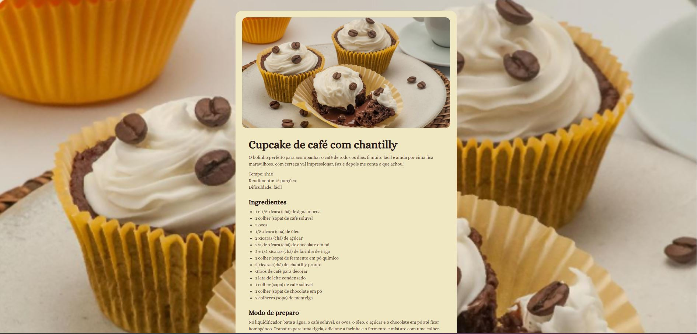

<h1 align="center">Página de receita</h1>

Programa exclusivo promovido pela Rocketseat para ensino de tecnologias WEB.

## 💻 Projeto

Esse projeto é uma página simples de receita de Cupcake de café com chantilly.
Esse é um dos projetos desenvolvidos em aula na formação Full-Stack da Rocketseat.

 

  

## 🚀 Tecnologias

Esse projeto foi desenvolvido com as seguintes tecnologias:

- HTML e CSS
- Git e Github
- Figma

## 🔖 Layout

Você pode visualizar o layout do projeto através [DESSE LINK](https://www.figma.com/community/file/1360315130061454535/pagina-de-receita). É necessário ter conta no [Figma](https://figma.com) para acessá-lo.

---
